# 🛒 Mercado Express API


API REST desenvolvida para o **Checkpoint 4 – Parte I** da disciplina de Java
(FIAP – Curso de Tecnologia em Análise e Desenvolvimento de Sistemas),
sob orientação do **Prof. Dr. Marcel Stefan Wagner**.

---

## 📋 Índice

- [Sobre o projeto](#-sobre-o-projeto)
- [Tecnologias utilizadas](#-tecnologias-utilizadas)
- [Arquitetura](#-arquitetura)
- [Estrutura de pastas](#-estrutura-de-pastas)
- [Pré-requisitos](#-pré-requisitos)
- [Como rodar localmente](#-como-rodar-localmente)
- [Configuração do banco de dados](#-configuração-do-banco-de-dados)
- [Tabela de endpoints](#-tabela-de-endpoints)
- [CRUD detalhado](#-crud-detalhado)
- [HATEOAS – nível 3 de maturidade de Richardson](#-hateoas--nível-3-de-maturidade-de-richardson)
- [Tratamento de erros](#-tratamento-de-erros)
- [Deploy](#-deploy)
- [IDE utilizada](#-ide-utilizada)
- [Integrantes](#-integrantes)

---

## 🎯 Sobre o projeto

O **Mercado Express** é um mercado de bairro que atende pedidos rápidos: o cliente
pede meias, produtos de limpeza, frutas — e recebe em minutos. Esta API é o back-end
que mantém o **catálogo de itens** desse mercado.

Cada item guarda:

| Campo     | Tipo         | Descrição                                              |
|-----------|--------------|--------------------------------------------------------|
| `id`      | `Long`       | Identificador único, gerado pela sequence Oracle       |
| `nome`    | `String`     | Nome comercial do produto                              |
| `tipo`    | `String`     | Tipo/categoria (Meia, Fruta, Produto de Limpeza...)    |
| `setor`   | `String`     | Setor do mercado (Vestuário, Hortifruti, Limpeza...)   |
| `tamanho` | `String`     | Tamanho/volume da embalagem (P, M, G, 500ml, 1kg...)   |
| `preco`   | `BigDecimal` | Preço unitário em reais (nunca negativo)               |

Os dados são persistidos de verdade no **Oracle da FIAP**, na tabela
`TDS_TB_MERCADO`, com IDs gerados pela sequence `TDS_SQ_MERCADO`.

<!-- [SUBSTITUIR] Print do Spring Initializr com as dependências selecionadas (Spring Web, Spring Data JPA, Lombok, Spring HATEOAS, Oracle Driver, Validation) -->
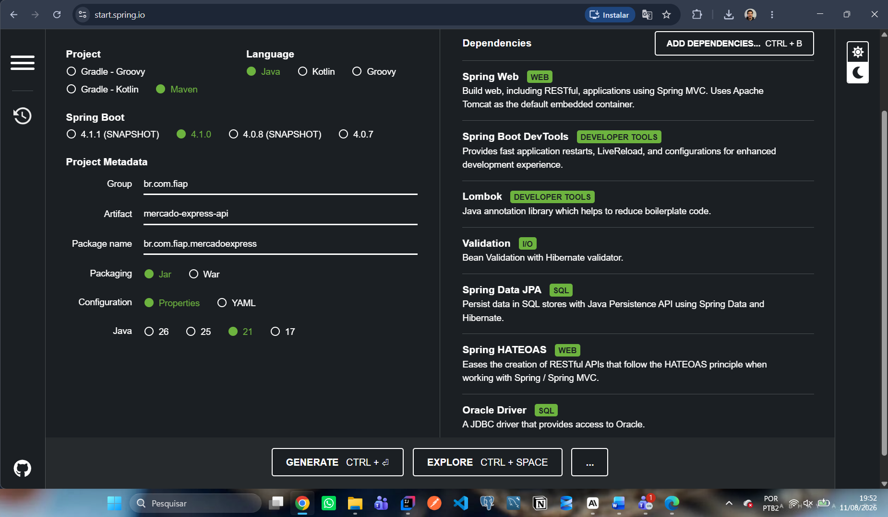

---

## 🧰 Tecnologias utilizadas

| Tecnologia            | Versão   | Papel no projeto                                          |
|-----------------------|----------|-----------------------------------------------------------|
| Java                  | 21 (LTS) | Linguagem                                                 |
| Spring Boot           | 4.1.0    | Framework base / servidor embarcado (Tomcat)              |
| Spring Web MVC        | —        | Camada REST                                               |
| Spring Data JPA       | —        | Persistência (Hibernate)                                  |
| Spring HATEOAS        | —        | `_links` nas respostas (nível 3 de Richardson)            |
| Bean Validation       | —        | Validação dos DTOs (`@NotBlank`, `@PositiveOrZero`...)    |
| Lombok                | —        | Elimina boilerplate nos modelos e DTOs                    |
| Oracle JDBC (ojdbc11) | —        | Driver do banco da FIAP                                   |
| H2 Database           | —        | Banco em memória do perfil `dev` (testes e fallback)      |
| Maven                 | 3.9      | Build e gerenciamento de dependências                     |
| Docker                | —        | Empacotamento para o deploy no Render                     |

---

## 🏗 Arquitetura

A aplicação segue a arquitetura em camadas clássica do Spring: o `Controller` só
cuida do HTTP, o `Service` concentra as regras de negócio e a conversão DTO ↔ entidade,
e o `Repository` fala com o banco. O `Assembler` é a camada que enriquece a resposta
com os links do HATEOAS.

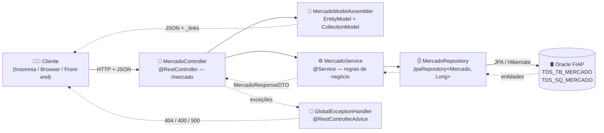

---

## 📂 Estrutura de pastas

```
mercado-express-api
├── database/
│   └── script.sql                    # DDL + sequence + massa de teste (Oracle)
├── docs/                             # Prints da entrega
├── src/main/java/br/com/fiap/mercadoexpress/
│   ├── MercadoExpressApiApplication.java
│   ├── assembler/MercadoModelAssembler.java
│   ├── config/CorsConfig.java
│   ├── controller/MercadoController.java
│   ├── dto/
│   │   ├── MercadoRequestDTO.java
│   │   ├── MercadoPatchDTO.java
│   │   └── MercadoResponseDTO.java
│   ├── exception/
│   │   ├── ErroResposta.java
│   │   ├── GlobalExceptionHandler.java
│   │   └── RecursoNaoEncontradoException.java
│   ├── model/Mercado.java
│   ├── repository/MercadoRepository.java
│   └── service/MercadoService.java
├── src/main/resources/
│   ├── application.properties         # perfil default (Oracle)
│   ├── application-dev.properties     # perfil dev (H2)
│   └── db/data-dev.sql                # massa de teste do H2
├── .env.example                       # chaves de ambiente (sem valores!)
├── Dockerfile                         # build multi-stage
├── render.yaml                        # blueprint de deploy
├── insomnia_collection.json           # collection com os 6 requests
└── integrantes.txt
```

---

## ✅ Pré-requisitos

- **JDK 21** instalado (`java -version`)
- **Maven** (ou use o wrapper `./mvnw` já incluso)
- Acesso ao **Oracle da FIAP** (usuário RM e senha) — ou use o perfil `dev` com H2
- **SQL Developer** (ou similar) para executar o script do banco
- **Insomnia** ou **Postman** para testar os endpoints

---

## ▶️ Como rodar localmente

### 1. Clonar o repositório

```bash
git clone https://github.com/olavoneves/mercadoexpress-api.git
cd mercadoexpress-api
```

### 2. Criar a tabela no Oracle

Abra o **SQL Developer**, conecte com o seu usuário RM e execute o arquivo
[`database/script.sql`](database/script.sql). Ele faz, nesta ordem:

1. `DROP` da tabela e da sequence (ignore os erros na primeira execução);
2. `CREATE TABLE TDS_TB_MERCADO` com **PK** e **CHECK (PRECO >= 0)**;
3. `CREATE SEQUENCE TDS_SQ_MERCADO`;
4. três `INSERT`s de exemplo (um de cada setor) usando `NEXTVAL`;
5. `COMMIT`.

<!-- [SUBSTITUIR] Print do SQL Developer mostrando a tabela TDS_TB_MERCADO criada e o SELECT com os 3 registros -->
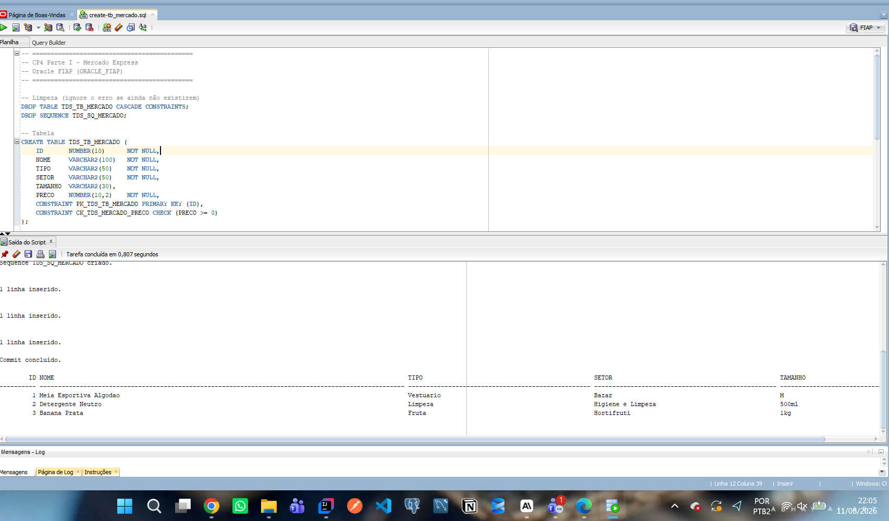

### 3. Configurar as credenciais

As credenciais **nunca** ficam no código. Copie o `.env.example` para `.env` e preencha:

```bash
cp .env.example .env
```

```properties
DB_URL=jdbc:oracle:thin:@oracle.fiap.com.br:1521:ORCL
DB_USER=rm550000
DB_PASSWORD=sua_senha
```

Depois exporte as variáveis antes de subir a aplicação:

**Windows (PowerShell):**
```powershell
$env:DB_USER = "rm550000"
$env:DB_PASSWORD = "sua_senha"
```

**Linux / macOS:**
```bash
export DB_USER=rm550000
export DB_PASSWORD=sua_senha
```

> No IntelliJ IDEA você também pode preencher isso em
> *Run → Edit Configurations → Environment variables*.

### 4. Subir a aplicação

```bash
./mvnw clean package
java -jar target/mercado-express-api-0.0.1-SNAPSHOT.jar
```

Ou, direto pelo Maven:

```bash
./mvnw spring-boot:run
```

A API sobe em **http://localhost:8082/mercado**.

<!-- [SUBSTITUIR] Print do console/IntelliJ mostrando "Tomcat started on port 8082" -->
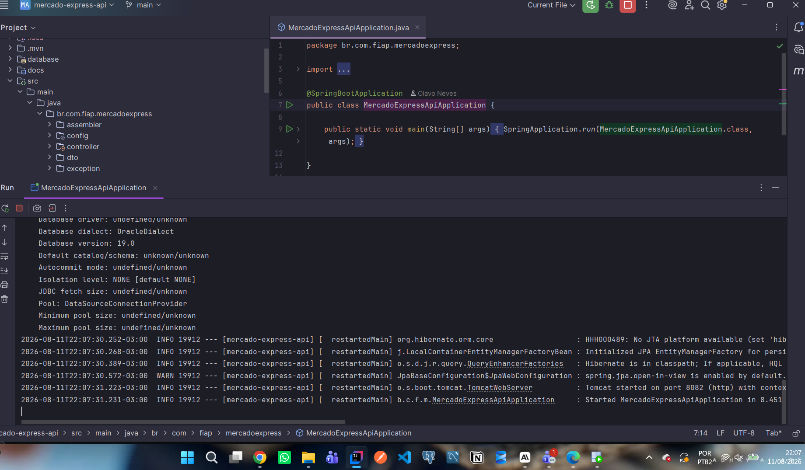

### 5. (Opcional) Rodar sem Oracle, com o perfil `dev`

Se você não estiver na rede da FIAP, suba com o banco H2 em memória —
a tabela, a sequence e os 3 registros de exemplo são criados automaticamente:

```bash
java -jar target/mercado-express-api-0.0.1-SNAPSHOT.jar --spring.profiles.active=dev
```

Console do H2: <http://localhost:8082/h2-console> (JDBC URL `jdbc:h2:mem:mercadoexpress`, usuário `sa`, senha em branco).

### 6. Testar

Importe o arquivo [`insomnia_collection.json`](insomnia_collection.json) no Insomnia
(*Application → Preferences → Data → Import Data*). A collection já vem com os
6 requests apontando para `http://localhost:8082/mercado`.

---

## 🗄 Configuração do banco de dados

### Perfil padrão — Oracle FIAP (`application.properties`)

```properties
server.port=${PORT:8082}
spring.datasource.url=${DB_URL:jdbc:oracle:thin:@oracle.fiap.com.br:1521:ORCL}
spring.datasource.username=${DB_USER}
spring.datasource.password=${DB_PASSWORD}
spring.jpa.hibernate.ddl-auto=none
spring.jpa.properties.hibernate.dialect=org.hibernate.dialect.OracleDialect
```

> `ddl-auto=none`: o schema é criado pelo `script.sql`, não pelo Hibernate.
> `PORT` só é usado pelo container do Render; localmente o default é sempre **8082**.

### Perfil `dev` — H2 em memória (`application-dev.properties`)

Existe por dois motivos: permitir desenvolvimento/teste sem VPN da FIAP e servir de
**fallback do deploy**, já que o Oracle da FIAP costuma recusar conexões vindas de IPs
externos (como os do Render).

### Geração de ID

```java
@Id
@GeneratedValue(strategy = GenerationType.SEQUENCE, generator = "seqMercado")
@SequenceGenerator(name = "seqMercado", sequenceName = "TDS_SQ_MERCADO", allocationSize = 1)
private Long id;
```

---

## 🌐 Tabela de endpoints

Base URL local: `http://localhost:8082`

| Método   | Rota            | Descrição                                            | Status de sucesso |
|----------|-----------------|------------------------------------------------------|-------------------|
| `GET`    | `/mercado`      | Lista todos os itens do mercado                      | `200 OK`          |
| `GET`    | `/mercado/{id}` | Busca um item específico pelo id                     | `200 OK`          |
| `POST`   | `/mercado`      | Cria um novo item (retorna header `Location`)        | `201 Created`     |
| `PUT`    | `/mercado/{id}` | Substitui **todos** os campos do item                | `200 OK`          |
| `PATCH`  | `/mercado/{id}` | Atualiza **somente** os campos enviados              | `200 OK`          |
| `DELETE` | `/mercado/{id}` | Remove o item                                        | `204 No Content`  |

Erros possíveis: `400 Bad Request` (validação), `404 Not Found` (id inexistente),
`500 Internal Server Error` (falha inesperada).

---

## 🔄 CRUD detalhado

### 1️⃣ GET `/mercado` — listar todos

Retorna a coleção completa. A resposta é um `CollectionModel`: cada item vem com os
seus próprios `_links` e a coleção ganha os links de navegação e criação.

**Request**
```http
GET http://localhost:8082/mercado
Accept: application/json
```

**Response — `200 OK`**
```json
{
  "_embedded": {
    "mercadoResponseDTOList": [
      {
        "_links": {
          "self":   { "href": "http://localhost:8082/mercado/1" },
          "all":    { "href": "http://localhost:8082/mercado" },
          "update": { "href": "http://localhost:8082/mercado/1" },
          "patch":  { "href": "http://localhost:8082/mercado/1" },
          "delete": { "href": "http://localhost:8082/mercado/1" }
        },
        "id": 1,
        "nome": "Meia Cano Alto Algodao",
        "tipo": "Meia",
        "setor": "Vestuario",
        "tamanho": "M",
        "preco": 19.90
      },
      {
        "_links": {
          "self":   { "href": "http://localhost:8082/mercado/2" },
          "all":    { "href": "http://localhost:8082/mercado" },
          "update": { "href": "http://localhost:8082/mercado/2" },
          "patch":  { "href": "http://localhost:8082/mercado/2" },
          "delete": { "href": "http://localhost:8082/mercado/2" }
        },
        "id": 2,
        "nome": "Detergente Neutro",
        "tipo": "Produto de Limpeza",
        "setor": "Limpeza",
        "tamanho": "500ml",
        "preco": 3.49
      },
      {
        "_links": {
          "self":   { "href": "http://localhost:8082/mercado/3" },
          "all":    { "href": "http://localhost:8082/mercado" },
          "update": { "href": "http://localhost:8082/mercado/3" },
          "patch":  { "href": "http://localhost:8082/mercado/3" },
          "delete": { "href": "http://localhost:8082/mercado/3" }
        },
        "id": 3,
        "nome": "Banana Prata",
        "tipo": "Fruta",
        "setor": "Hortifruti",
        "tamanho": "1kg",
        "preco": 7.99
      }
    ]
  },
  "_links": {
    "self":   { "href": "http://localhost:8082/mercado" },
    "all":    { "href": "http://localhost:8082/mercado" },
    "create": { "href": "http://localhost:8082/mercado" }
  }
}
```

<!-- [SUBSTITUIR] Print do GET /mercado no Insomnia mostrando request + response 200 com a lista e os _links -->
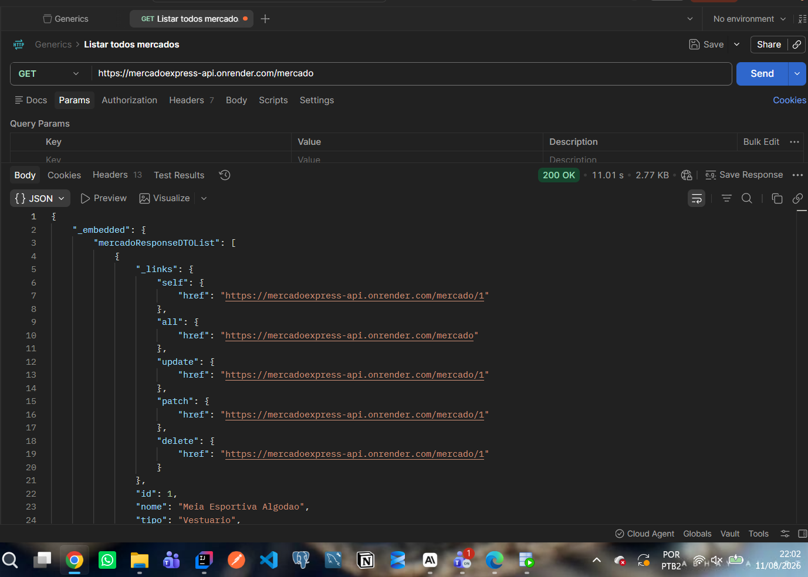

---

### 2️⃣ GET `/mercado/{id}` — buscar por id

Retorna um único item. Se o id não existir, o `GlobalExceptionHandler` devolve `404`.

**Request**
```http
GET http://localhost:8082/mercado/1
Accept: application/json
```

**Response — `200 OK`**
```json
{
  "_links": {
    "self":   { "href": "http://localhost:8082/mercado/1" },
    "all":    { "href": "http://localhost:8082/mercado" },
    "update": { "href": "http://localhost:8082/mercado/1" },
    "patch":  { "href": "http://localhost:8082/mercado/1" },
    "delete": { "href": "http://localhost:8082/mercado/1" }
  },
  "id": 1,
  "nome": "Meia Cano Alto Algodao",
  "tipo": "Meia",
  "setor": "Vestuario",
  "tamanho": "M",
  "preco": 19.90
}
```

<!-- [SUBSTITUIR] Print do GET /mercado/1 no Insomnia mostrando request + response 200 -->
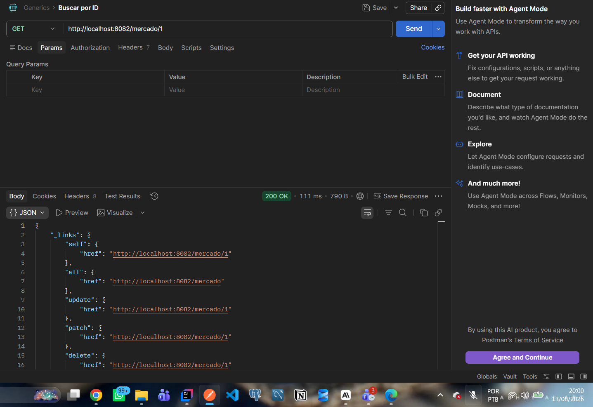

---

### 3️⃣ POST `/mercado` — criar

Cria um novo item. Todos os campos obrigatórios são validados antes de chegar ao
service; a resposta traz **`201 Created`** e o header **`Location`** apontando para
o recurso recém-criado (o mesmo endereço do link `self`).

**Request**
```http
POST http://localhost:8082/mercado
Content-Type: application/json
```
```json
{
  "nome": "Sabao em Po Concentrado",
  "tipo": "Produto de Limpeza",
  "setor": "Limpeza",
  "tamanho": "1kg",
  "preco": 18.90
}
```

**Response — `201 Created`**
```http
Location: http://localhost:8082/mercado/4
Content-Type: application/hal+json
```
```json
{
  "_links": {
    "self":   { "href": "http://localhost:8082/mercado/4" },
    "all":    { "href": "http://localhost:8082/mercado" },
    "update": { "href": "http://localhost:8082/mercado/4" },
    "patch":  { "href": "http://localhost:8082/mercado/4" },
    "delete": { "href": "http://localhost:8082/mercado/4" }
  },
  "id": 4,
  "nome": "Sabao em Po Concentrado",
  "tipo": "Produto de Limpeza",
  "setor": "Limpeza",
  "tamanho": "1kg",
  "preco": 18.90
}
```

<!-- [SUBSTITUIR] Print do POST no Insomnia mostrando request + response 201 (destacar o header Location) -->
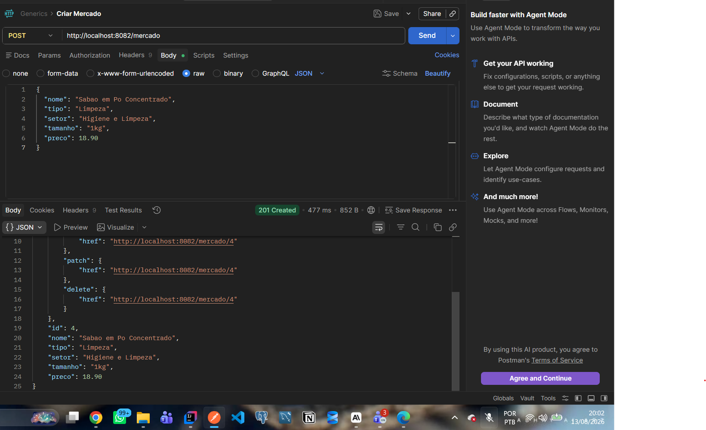

---

### 4️⃣ PUT `/mercado/{id}` — substituir

O `PUT` é uma **substituição integral**: o corpo precisa trazer todos os campos
obrigatórios, e o que não for enviado é sobrescrito. É a diferença essencial para o `PATCH`.

**Request**
```http
PUT http://localhost:8082/mercado/4
Content-Type: application/json
```
```json
{
  "nome": "Sabao em Po Premium",
  "tipo": "Produto de Limpeza",
  "setor": "Limpeza",
  "tamanho": "2kg",
  "preco": 29.90
}
```

**Response — `200 OK`**
```json
{
  "_links": {
    "self":   { "href": "http://localhost:8082/mercado/4" },
    "all":    { "href": "http://localhost:8082/mercado" },
    "update": { "href": "http://localhost:8082/mercado/4" },
    "patch":  { "href": "http://localhost:8082/mercado/4" },
    "delete": { "href": "http://localhost:8082/mercado/4" }
  },
  "id": 4,
  "nome": "Sabao em Po Premium",
  "tipo": "Produto de Limpeza",
  "setor": "Limpeza",
  "tamanho": "2kg",
  "preco": 29.90
}
```

<!-- [SUBSTITUIR] Print do PUT no Insomnia mostrando request + response 200 com o item alterado -->
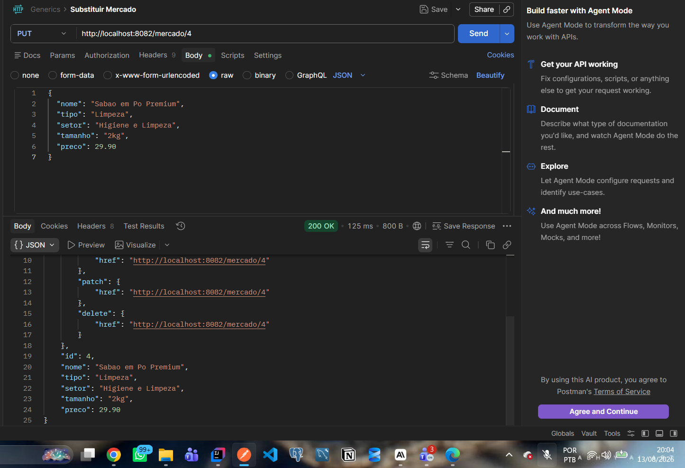

---

### 5️⃣ PATCH `/mercado/{id}` — atualização parcial

O `PATCH` aplica **somente os campos não nulos** do payload. No exemplo abaixo só o
preço é enviado — nome, tipo, setor e tamanho permanecem exatamente como estavam.

**Request**
```http
PATCH http://localhost:8082/mercado/4
Content-Type: application/json
```
```json
{
  "preco": 15.50
}
```

**Response — `200 OK`**
```json
{
  "_links": {
    "self":   { "href": "http://localhost:8082/mercado/4" },
    "all":    { "href": "http://localhost:8082/mercado" },
    "update": { "href": "http://localhost:8082/mercado/4" },
    "patch":  { "href": "http://localhost:8082/mercado/4" },
    "delete": { "href": "http://localhost:8082/mercado/4" }
  },
  "id": 4,
  "nome": "Sabao em Po Premium",
  "tipo": "Produto de Limpeza",
  "setor": "Limpeza",
  "tamanho": "2kg",
  "preco": 15.50
}
```

<!-- [SUBSTITUIR] Print do PATCH no Insomnia mostrando que só o preço mudou (response 200) -->
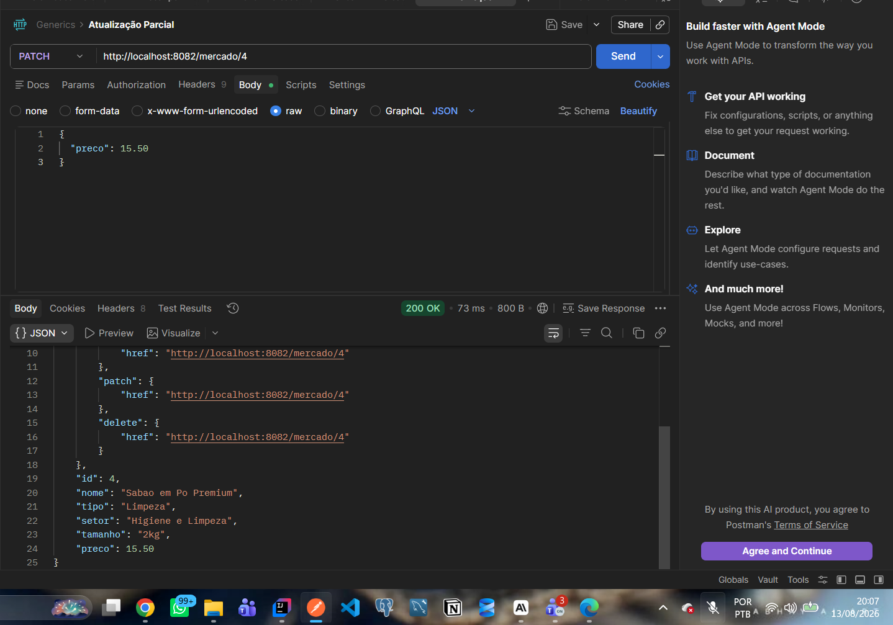

---

### 6️⃣ DELETE `/mercado/{id}` — remover

Remove o item e devolve **`204 No Content`** — sem corpo, como manda a semântica HTTP.
Uma nova consulta ao mesmo id passa a retornar `404`.

**Request**
```http
DELETE http://localhost:8082/mercado/4
```

**Response — `204 No Content`** *(sem corpo)*

**Consultando o id removido — `404 Not Found`**
```json
{
  "timestamp": "2026-08-11T20:28:59.7832675",
  "status": 404,
  "erro": "Not Found",
  "mensagem": "Nenhum item do mercado encontrado com o id 4",
  "caminho": "/mercado/4"
}
```

<!-- [SUBSTITUIR] Print do DELETE no Insomnia mostrando o status 204 No Content -->
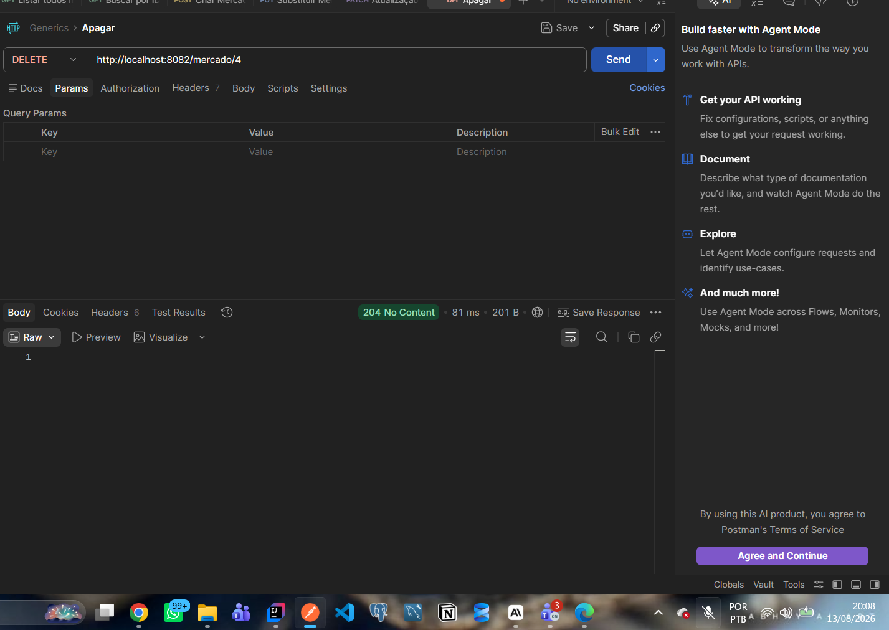

---

## 🔗 HATEOAS – nível 3 de maturidade de Richardson

O **Modelo de Maturidade de Richardson** classifica APIs em quatro níveis:

| Nível | O que caracteriza                                                          | Esta API |
|-------|----------------------------------------------------------------------------|----------|
| 0     | Um único endpoint, tudo via POST (RPC sobre HTTP)                          | —        |
| 1     | Recursos com URIs próprias (`/mercado`, `/mercado/1`)                      | ✅       |
| 2     | Uso correto dos verbos HTTP e dos status codes (GET/POST/PUT/PATCH/DELETE, 200/201/204/400/404) | ✅ |
| 3     | **HATEOAS**: a resposta descreve as próximas transições possíveis via `_links` | ✅       |

### Por que a resposta traz `_links`?

No nível 3, o cliente não precisa conhecer — nem montar — as URLs da API. Ele recebe,
junto com os dados, **os caminhos das ações que pode executar naquele recurso**:

- `self` → o endereço do próprio item;
- `all` → volta para a listagem completa;
- `update` → onde fazer o `PUT` (substituição total);
- `patch` → onde fazer o `PATCH` (atualização parcial);
- `delete` → onde remover o item.

Isso deixa a API **auto-descritiva** e **desacoplada**: se amanhã a rota mudar de
`/mercado/{id}` para `/api/v2/mercado/{id}`, o cliente que navega pelos links continua
funcionando sem alteração de código. É a mesma ideia da web — você não digita a URL de
cada página, você segue os links que ela oferece.

### Como foi implementado

A montagem dos links fica isolada no `MercadoModelAssembler`, que implementa
`RepresentationModelAssembler` e usa `WebMvcLinkBuilder` para gerar as URLs
**a partir dos próprios métodos do controller** (nada de string concatenada — se a
assinatura do método mudar, o link acompanha):

```java
@Override
public EntityModel<MercadoResponseDTO> toModel(MercadoResponseDTO dto) {
    return EntityModel.of(dto,
            linkTo(methodOn(MercadoController.class).buscarPorId(dto.getId())).withSelfRel(),
            linkTo(methodOn(MercadoController.class).listarTodos()).withRel("all"),
            linkTo(methodOn(MercadoController.class).atualizar(dto.getId(), null)).withRel("update"),
            linkTo(methodOn(MercadoController.class).atualizarParcialmente(dto.getId(), null)).withRel("patch"),
            linkTo(methodOn(MercadoController.class).deletar(dto.getId())).withRel("delete"));
}
```

- **Respostas individuais** (`GET by id`, `POST`, `PUT`, `PATCH`) → `EntityModel` com os 5 links.
- **Resposta de coleção** (`GET all`) → `CollectionModel` em que **cada item** carrega os
  5 links e a coleção ainda expõe `self`, `all` e `create`.

O `Content-Type` das respostas é `application/hal+json`, o formato padrão de hipermídia
usado pelo Spring HATEOAS.

---

## 🚨 Tratamento de erros

Centralizado no `GlobalExceptionHandler` (`@RestControllerAdvice`), com corpo de resposta padronizado:

| Situação                                   | Status | Exceção tratada                     |
|--------------------------------------------|--------|-------------------------------------|
| Id inexistente                             | `404`  | `RecursoNaoEncontradoException`     |
| Campos inválidos no corpo                  | `400`  | `MethodArgumentNotValidException`   |
| JSON malformado / tipo incompatível        | `400`  | `HttpMessageNotReadableException`   |
| Falha inesperada                           | `500`  | `Exception`                         |

**Exemplo de `400` — POST com nome vazio e preço negativo:**

```json
{
  "timestamp": "2026-08-11T20:28:59.8714739",
  "status": 400,
  "erro": "Bad Request",
  "mensagem": "Um ou mais campos estao invalidos. Confira a lista em 'campos'.",
  "caminho": "/mercado",
  "campos": [
    { "campo": "preco", "mensagem": "O preco deve ser maior ou igual a zero" },
    { "campo": "nome",  "mensagem": "O nome deve ter entre 2 e 100 caracteres" },
    { "campo": "nome",  "mensagem": "O nome do produto e obrigatorio" }
  ]
}
```

---

## 🚀 Deploy

**Link do deploy:** <!-- [SUBSTITUIR] --> `[PREENCHER LINK DO DEPLOY]`

<!-- [SUBSTITUIR] Print do serviço no ar (navegador acessando <url-do-deploy>/mercado com o JSON e os _links) -->
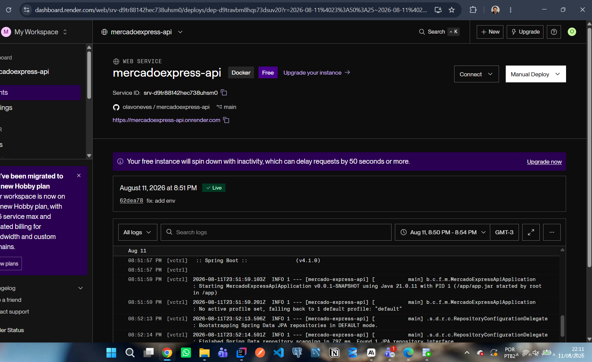

### Plataforma: Render (Docker)

O projeto já vem com [`Dockerfile`](Dockerfile) multi-stage
(`maven:3.9-eclipse-temurin-21` para o build → `eclipse-temurin:21-jre` para o runtime)
e com o blueprint [`render.yaml`](render.yaml).

### Passo a passo

1. Faça o push do projeto para o GitHub (o `Dockerfile` e o `render.yaml` precisam estar na raiz).
2. Acesse <https://render.com>, crie a conta e clique em **New → Blueprint**
   (ou **New → Web Service** e selecione *Docker* como runtime).
3. Conecte o repositório `mercadoexpress-api` e confirme — o Render lê o `render.yaml`
   e já configura nome, runtime Docker, plano free e health check em `/mercado`.
4. Em **Environment**, preencha as variáveis marcadas como `sync: false`:

   | Variável                 | Valor                                                       |
   |--------------------------|-------------------------------------------------------------|
   | `PORT`                   | `8082`                                                      |
   | `SPRING_PROFILES_ACTIVE` | `dev` (H2) **ou** vazio (Oracle)                            |
   | `DB_URL`                 | `jdbc:oracle:thin:@oracle.fiap.com.br:1521:ORCL`            |
   | `DB_USER`                | seu RM                                                      |
   | `DB_PASSWORD`            | sua senha                                                   |

5. Clique em **Apply / Create Web Service** e aguarde o build (~5 min na primeira vez).
6. A URL pública aparece no topo do painel. Teste com:
   `https://mercado-express-api.onrender.com/mercado`

> ⚠️ **Plano free do Render:** o serviço hiberna após ~15 minutos sem tráfego. A primeira
> requisição depois disso pode levar até 1 minuto para responder. Acesse a URL alguns
> minutos antes da apresentação para "acordar" a instância.

### 🔐 Sobre o Oracle da FIAP no deploy

O banco `oracle.fiap.com.br` normalmente **só aceita conexões da rede da FIAP**, recusando
os IPs externos da nuvem do Render. Por isso o `render.yaml` já sobe com
`SPRING_PROFILES_ACTIVE=dev`:

- **Deploy (Render)** → perfil `dev`, com **H2 em memória** e a mesma massa de teste;
  a API se comporta exatamente igual, inclusive nos `_links` do HATEOAS.
- **Local (avaliação)** → perfil padrão, com **persistência real no Oracle da FIAP**,
  na tabela `TDS_TB_MERCADO` e sequence `TDS_SQ_MERCADO`, conforme o print da seção
  [Configuração do banco de dados](#-configuração-do-banco-de-dados).

Se o Oracle aceitar a conexão externa, basta apagar o valor de `SPRING_PROFILES_ACTIVE`
no painel do Render e preencher `DB_URL`, `DB_USER` e `DB_PASSWORD` para o deploy passar
a usar o Oracle.

---

## 💻 IDE utilizada

**IntelliJ IDEA** — usada para toda a codificação, execução e testes do projeto.

---

## 👥 Integrantes

| Nome           | RM             |
|----------------|----------------|
| Olavo Neves    | `[PREENCHER]`  |
| `[PREENCHER]`  | `[PREENCHER]`  |
| `[PREENCHER]`  | `[PREENCHER]`  |

**Turma:** `[PREENCHER]`
**Curso:** Análise e Desenvolvimento de Sistemas (TDS) – FIAP
**Disciplina:** Java – Checkpoint 4, Parte I
**Professor:** Dr. Marcel Stefan Wagner

---

<div align="center">
  Desenvolvido para a FIAP 🎓
</div>
